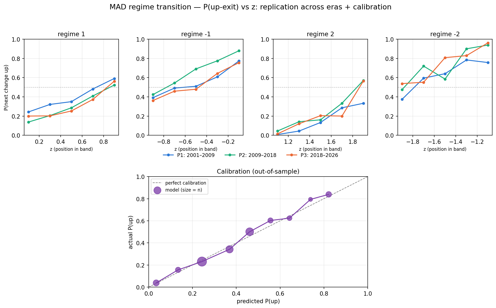

# MAD-Markov

**An interpretable semi-Markov model of market regimes.** Standardized Moving Average Distance (MAD) is binned into six ordered states, and a signal the discrete chain discards — where price sits within its band — forecasts the *direction* of the next regime transition, calibrated out-of-sample on 26 years of S&P 500 data. **It models regime state, not returns.**

---

## The idea

Moving-average systems usually collapse price into crossover events, throwing away the one quantity that describes the state of a trend: how far price sits from it. MAD keeps that displacement and turns it into an observable regime process.

1. **Displacement.** `MAD = 100 · (P − SMA₂₀) / P` — the signed % distance of price from its 20-day average.
2. **Standardize.** `z = MAD / σ₂₅₅`, where σ₂₅₅ is the trailing one-year standard deviation of MAD. This makes displacement comparable across calm and volatile markets.
3. **Discretize** `z` into six ordered regimes at thresholds ±1, ±2:

   | Regime | z-range | Interpretation |
   |:---:|:---:|---|
   | +3 | z > 2 | extended above trend |
   | +2 | 1 < z ≤ 2 | moderately above |
   | +1 | 0 < z ≤ 1 | mildly above |
   | −1 | −1 < z ≤ 0 | mildly below |
   | −2 | −2 < z ≤ −1 | moderately below |
   | −3 | z ≤ −2 | extended below |

4. **Model the regime sequence** as a semi-Markov process.

Every step is a causal, strictly trailing function of price — no latent states, no look-ahead, fully reproducible from the price history.

## The finding

- **Dwell times are not memoryless.** The hazard of leaving a regime *falls* with time already spent in it (duration dependence), so a first-order Markov chain is misspecified — the process is semi-Markov.
- **Within-band position forecasts the next transition.** Two days in the same discrete regime can carry very different odds: the higher `z` sits inside its band, the more likely the next regime change is *upward*. The relationship is strong, monotone, and — crucially — calibrated out-of-sample.
- **It replicates.** The gradient holds across three independent eras (≈2001–09, 2009–18, 2018–26); only the level drifts with the market's prevailing bias.

Out-of-sample, against a memoryless base-rate chain:

| Metric | MAD-Markov | Base rate |
|---|:---:|:---:|
| Brier score | **0.184** | 0.204 |
| Log-loss | **0.541** | 0.589 |
| Direction accuracy | 71.8% | 71.0% |
| Timing MAE (days) | 3.37 | 3.43 |

The edge is in *calibrated probabilities*, not hard calls — hard up/down accuracy ties, because the sample's drift keeps the sharper probability from crossing the decision boundary. (See the paper for why that is the honest way to score it.)



## The pipeline

Run the scripts in order; each writes its artifacts to `results/`.

| Script | Does | Key output |
|---|---|---|
| `01_data.py` | Pull daily SPY history (Yahoo Finance) | `results/01_spy.csv` |
| `02_mad_regime.py` | Compute SMA₂₀, MAD, σ₂₅₅, `z`, and the regime label | `results/02_spy_mad.csv` |
| `03_markov.py` | Empirical (semi-)Markov structure: transition matrix, jump chain, dwell times, hazards | `results/03_*.csv` |
| `04a_forecast_projection.py` | Head-to-head direction & timing predictors, out-of-sample | `results/04a_*.csv` |
| `04b_replication.py` | Replication across eras + out-of-sample calibration + figure | `results/04b_*.csv`, `.png` |
| `05_transition_model.py` | Walk-forward calibrated forecaster; scored vs base rate (Brier, log-loss) | `results/05_*.csv` |

## Install

```bash
pip install -r requirements.txt
```

Requires Python 3.8+ with `pandas`, `numpy`, `matplotlib`, and `yfinance`.

## Run

```bash
python3 01_data.py
python3 02_mad_regime.py
python3 03_markov.py
python3 04a_forecast_projection.py
python3 04b_replication.py
python3 05_transition_model.py
```

All outputs — CSVs and the calibration figure — land in `results/`.

## Reproducibility

The pipeline is deterministic given the same input data. Because `01_data.py` pulls live prices from Yahoo Finance, re-running it *extends* the sample beyond the window used in the paper, so the exact figures (Brier 0.184, etc.) may drift slightly as new data arrives. What replicates is the structure — the monotone within-band gradient, the out-of-sample calibration, and the semi-Markov dwell.

## Repository layout

```
.
├── 01_data.py … 05_transition_model.py   # the pipeline, run in order
├── results/                              # generated CSVs + calibration figure
├── requirements.txt
└── README.md
```

## Paper

The full write-up — *"Position Within Trend: The MAD-Markov Model for Calibrated Regime-Transition Forecasting"* — is available here: **[add link]**.

## References

The model is developed in dialogue with, and deliberately distinguished from, prior work — notably Avramov, Kaplanski & Subrahmanyam's cross-sectional "moving average distance" (a different construction), Hamilton's regime-switching models, and recent deep-learning momentum research (Wood, Roberts & Zohren). Full citations are in the paper. Third-party papers are cited, not redistributed.

## License

MIT — see [`LICENSE`](LICENSE).

## Disclaimer

MAD-Markov is an independent, self-directed research project developed exclusively on my personal time. It is not affiliated with, sponsored by, or conducted on behalf of the Department of the Army, the Department of War, or any U.S. Government entity.
